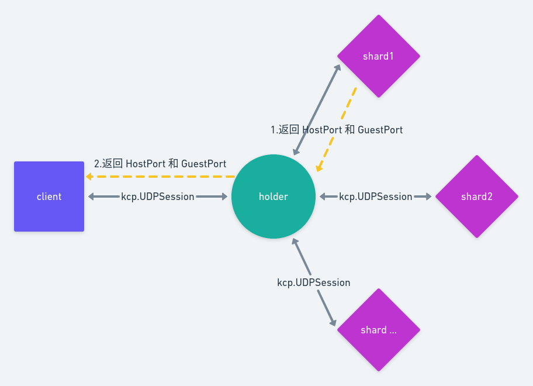
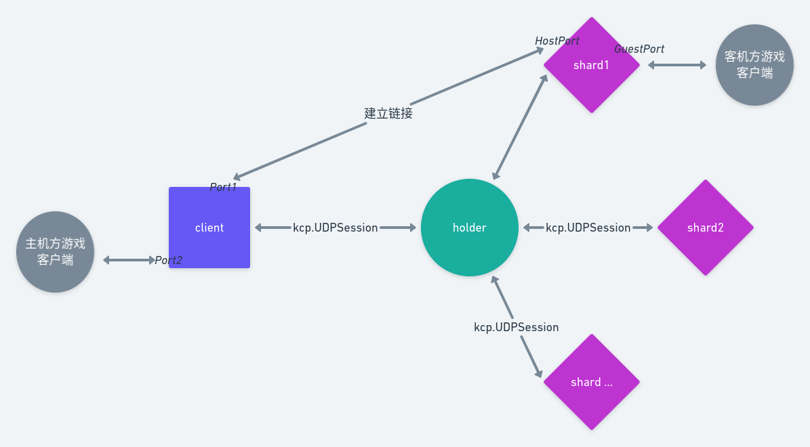

# Shitama 的历史

> 「Shitama」是一个类毛玉服务，可以为「东方非想天则」提供简单的端口转发功能，让身处内网的玩家能够建立主机并进行对战。

根据 Shitama 的 commit 的记录原作者应该是 [evshiron](https://github.com/evshiron) ，不过现在 evshiron 的 github 上已经找不到 shitama 的相关源码，可以找到的是 [Remi_IO 的一份 fork](https://github.com/u-u-z/shitama)，现在 [Si-Huan/shitama](https://github.com/Si-Huan/shitama) 便是 fork 自 Remi_IO 的 fork .

# 非想天则联机机制与 Shitama 实现的功能

接下来，因为懒，我会将 Shitama 写为 shitama.

> 在此约定: 下文中 <u>主机方</u> 根据不同语境，指 <u>在联机对战中建立主机的那个人</u>、<u>在联机对战中建立主机的那个游戏客户端</u> 或者 <u>在联机对战中建立主机一方的电脑</u>。<u>客机方</u> 指什么大家自己类推一下吧（

先简略说一下非想天则的联机机制，主机方指定本地端口建立房间，客机方输入主机方 ip:port  进行连接。

那么现在的问题是：

> 如今，网络地址转换（Network Address Translation，NAT）设备如光猫、路由器等日益普及，许多联网设备失去了被从公网访问的能力。尽管某些情况下可以通过调整配置解决，例如对所有途径的NAT设备进行端口映射如配置虚拟服务器、DMZ主机，在多数情况下人们并没有调整配置的权限，如小区宽带，运营商NAT，网吧路由器，甚至拿不到超级帐号的光猫等等。[Watching.md](https://github.com/Si-Huan/shitama/blob/master/docs/zh_CN/Watching.md)

shitama 实现的功能是：

> 类毛玉正是为了解决这个问题而出现的。有别于虚拟局域网如Hamachi、QQ对战平台、浩方对战平台、游侠对战平台，类毛玉通过将非想天则主机的端口转发到公网服务器上，使其它用户可以通过公网服务器的端口连接到处于内网的主机，从而进行对战。[Watching.md](https://github.com/Si-Huan/shitama/blob/master/docs/zh_CN/Watching.md)

# shitama 构成与一次联机的工作过程图示

shitama 的分为四部分:

- clinet
- holder
- shard
- client-ui-qt

其中第四部分是 client 的一个壳，与 client 本体通过 http 通信。使用 Qt/C++ 编写，其余部分使用 go 编写，因为本菜鸡全然不了解 Qt/C++ ，故 client-ui-qt 不在本文讨论范围。

在此呢，我先放几张图，大致展示一下在 shitama 帮助下一次联机的过程

1. client 向 holder 发起中转请求，请求中指定了 shardAddr 与 transport，即 shard 地址和使用的传输协议（目前只有 UDP 可选）。

2. holder 收到请求后向被指定的 shard 发起中转请求  

3. shard 收到请求后会准备两个端口，此处几位 HostPort 和 GuestPort。并向 holder 返回这两个端口号

4. holder 收到 shard 发来的端口后向 client 返回这两个端口号

5. client 得知 shard 已经准备好两个端口后，会建立和 shard:HostPort 的链接，并把 shard:GuestPort 展示给使用者，这时候 client 的使用者就可以通过 im 把 shard:GuestPort 发送给客机方。

6. 客机方在游戏客户端填入 shard:GuestPort 进行联机对战

不难发现其中相对复杂的部分是 shard HostPort 与 GuestPort 之间发生了什么，以及主机方游戏客户端（一般来说为主机方的 10800 端口）与 client 发生了什么。

其实简略来说的话就是，shard GuestPort  和 客机方建立通信，HostPort 和 client 的某个端口（记作 Port1）通信，clinet 的另一个端口（记作 Port2）和主机方游戏客户端通信，主机方客户端发送数据给 Port2， Port2 收到数据会使用 Port1 发出去，也就是发给 HostPort，HostPort 收到数据会通过 GuestPort 发出去也就是发给客机方游戏客户端。因为涉及到观战的问题，主机方 client 的实际情况要比我说的复杂一些。

图中虚线的意味： shard1 中由 HostPort 指向 GuestPort 的虚线意味着 HostPort 并不会向 GuestPort 发送数据，而是每当 HostPort 收到来自 Port1 的数据就会使用 GuestPort 发送出去。也就是说 HostPort 只与 Port1 通信。

