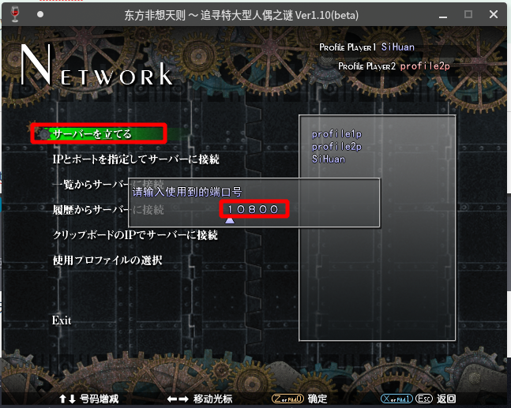
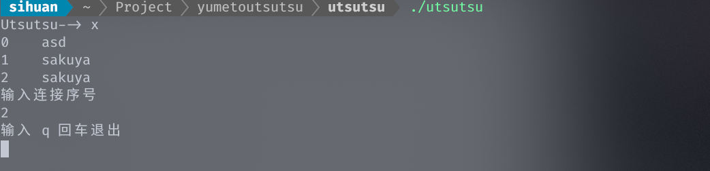
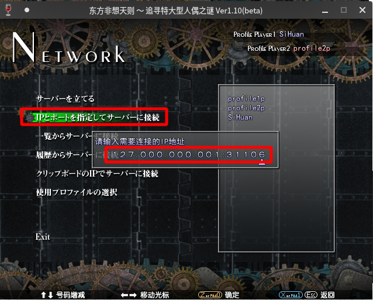

# 夢と現

> 一个打则工具，与 shitama 原理上略有不同，也许会对某些网络有奇效。
>
> 现在还是仅仅能用的阶段，没有图形界面，只有一个服务器可以选择（也就是，没得选）

## 用法

### 建立主机

1. 打开 utsutsu ，输入 `c` 并回车，根据提示输入昵称之后回车，然后就不用管了 utsutsu 了

   

2. 打开非想天则，选择网络对战，使用默认端口 `10800` 建立主机

   

3. 等待连入就 OK 啦

### 客机连入

> 和 shitama 不同的地方是，客机也需要使用 utsutsu 才行（

1. 打开 utsutsu ，输入 `x` 并回车，输入想连接的对手的序号之后回车

> 不用在意为啥会有两个 sakuya （ 这个问题有待处理，所以大家在建主的时候要用自己特色的名字

2. 打开非想天则，选择网络对战，连接 `127.0.0.1：31106` 这个 IP 地址进行对战（这个地址是不会变化）

## 最后

这个东西现在问题很多，但是如果按照上述操作至少是可以用的。

已知问题

1. 建立主机的人退出 utsutsu 之后，需要一段时间才不会在客机的列表里出现
2. 按 p 无法退出，这个在做了
3. 等等等 不想写了 太多

遇到问题之后现在较好的解决方案是重启 utsutsu （