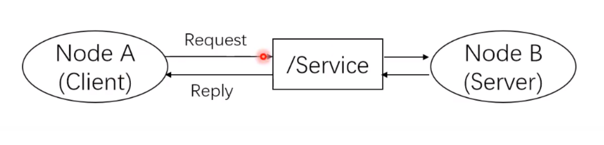

# ROS 文件系统      

## catkin 工作空间

ROS 工程结构如下

```text
catkin_ws
├── build
│   └── ...
├── devel
│   └── ...
└── src
    ├── CMakeLists.txt -> /opt/ros/kinetic/share/catkin/cmake/toplevel.cmake
    └── exercise_three
        ├── CMakeLists.txt
        ├── include
        │   └── exercise_three
        ├── msg
        │   └── addend.msg
        ├── package.xml
        ├── src
        │   ├── client_call_add.cpp
        │   ├── pub_test.cpp
        │   ├── server_call_add.cpp
        │   └── sub_test.cpp
        └── srv
            └── CallAdd.srv
```


catkin 是 cmake 扩展，是 ROS 使用的编译系统。较旧版本可能使用 rosbuild，已弃用。

在 `catkin_ws` 目录中使用 `catkin_make` 可以进行工程初始化来生成基础的目录结构（需要 `catkin_ws/src` 目录存在），编译也使用 `catkin_make` 命令。

编译时注意目录，需要在 `src` 目录父目录下，`catkin_ws`会找到 `src` 文件夹，然后按文件夹递归查找 package，package 是 catkin 编译最小单位。

> Tips：编译后需要 `source ~/catkin_ws/devel/setip.bash`，不过此工作已经在安装一节添加到了 `~/.bashrc` 中

## package 组成

package 即功能包，是 ROS 基本组织形式，也是 catkin 的编译基本单元。

一个 package 可以包括多个可执行文件，在 CMakeLists.txt 中指定生成多个可执行文件即可。

package 认定方式 CMakeLists.txt 和 package.xml

### CMakeLists.txt

`CMakeLists.txt` 规定了 catkin 的编译规则 。定义了源文件、依赖项和目标文件。 #TODO 读 CMake 实践

包括以下函数

```cmake
cmake_minimum_required() #CMake的版本号 
project()                #项目名称 
find_package()           #找到编译需要的其他CMake/Catkin package
catkin_python_setup()    #catkin新加宏，打开catkin的Python Module的支持
add_message_files()      #catkin新加宏，添加自定义Message/Service/Action文件
add_service_files()
add_action_files()
generate_message()       #catkin新加宏，生成不同语言版本的msg/srv/action接口
catkin_package()         #catkin新加宏，生成当前package的cmake配置，供依赖本包的其他软件包调用
add_library()            #生成库
add_executable()         #生成可执行二进制文件
add_dependencies()       #定义目标文件依赖于其他目标文件，确保其他目标已被构建
target_link_libraries()  #链接
catkin_add_gtest()       #catkin新加宏，生成测试
install()                #安装至本机
```

### package.xml

`package.xml` 定义了一些包的元信息。可用的标签如下

```xml
<pacakge>               根标记文件  
<name>                  包名  
<version>               版本号  
<description>           内容描述  
<maintainer>            维护者 
<license>               软件许可证  
<buildtool_depend>      编译构建工具，通常为catkin    
<depend>                指定依赖项为编译、导出、运行需要的依赖，最常用
<build_depend>          编译依赖项  
<build_export_depend>   导出依赖项
<exec_depend>           运行依赖项
<test_depend>           测试用例依赖项  
<doc_depend>            文档依赖项
```

一个例子

```xml
<?xml version="1.0"?>
<package format="2">
  <name>exercise_three</name>
  <version>0.0.0</version>
  <description>The exercise_three package</description>
  <maintainer email="sihuan@sakuya.love">sihuan</maintainer>
  <license>TODO</license>
  <buildtool_depend>catkin</buildtool_depend>
  <build_depend>message_generation</build_depend>
  <build_depend>roscpp</build_depend>
  <build_depend>rospy</build_depend>
  <build_depend>std_msgs</build_depend>
  <build_export_depend>roscpp</build_export_depend>
  <build_export_depend>rospy</build_export_depend>
  <build_export_depend>std_msgs</build_export_depend>
  <exec_depend>message_runtime</exec_depend>
  <exec_depend>roscpp</exec_depend>
  <exec_depend>rospy</exec_depend>
  <exec_depend>std_msgs</exec_depend>

  <export>
  </export>
</package>

```

`rosbuild` 等效的文件是 `manifest.xml`，已经弃用

### package 里的代码文件的组织

- shell、python 脚本

  > package/scripts/*.{sh,py}

- C++ .h/.cpp

  > package/include
  >
  > package/src/*.cpp

- 自定义的通信格式

  - msg 消息

    > package/msg/*.msg

  - srv 服务

    > package/srv/*.srv

  - actions 动作

- launch 文件 负责启动多个可执行文件

  > package/launch/*.launch

- 配置文件 格式自定义

  > package/config/*

### 常用包管理指令

1. rospack

   `rospack find *pkg_name*`   可以按包名查找 package

   `rospack list` 列出所有包

2. roscd

   `roscd *pkg_name*` 进入到指定包目录

3. rosls

   `rosls *pkg_name*` 列出指定包含有的文件

4. rosed

   > rosed *package_name* *file_name*
   >
   > 编辑指定包下指定文件
   >
   > 编辑器使用 EDITOR 变量定义，默认为 vim

5. catkin_create_pkg

   > catkin_create_pkg *<pkg_name>*  [*deps*]
   >
   > 创建一个包，指定包名和依赖

6. rosdep

   > rosdep install [*pkg_name*]
   >
   > 安装指定包列表的依赖包


### Metapackage

元包，虚包，靠依赖引入一系列软件包，将具有相似功能的软件包组织起来

# 通信架构

## master 和 node

node 节点启动之前需要先向 master 注册，然后通过 master 接受 node 之间可以进行两两点对点通信

**启动 master**

`roscore`

> 会启动 master 节点，rosout 节点（负责日志输出）还有一个 parameter server 参数服务器

一个 node 就是一个 ROS 的进程，就是 pkg 里的可执行文件在内存运行的实例

**node 相关命令**

`rosrun [pkg_name] [node_name]` 

> 启动一个 node
>
> node name 并非可执行文件名，而是在代码里定义的节点名

`rosnode ` 

> 子命令
>
>  - list
>
>    列出当前运行的 node 信息
>
>  - info [node_name]
>
>    显示某 node 的详细信息
>
>    ​	需要 node 正在运行
>
>  - kill [node_name]
>
>    结束某个 node

`roslaunch [pkg_name] [file_name.launch]`

> 批量启动 node
>
> roslaunch 会检测 master 是否在运行，没有运行会先调用 `roscore` 启动 master

​	launch 文件的格式为 `xml`，包含如下标签

```xml
<launch>    <!--根标签-->
<node>    <!--需要启动的node及其参数-->
<include>    <!--包含其他launch-->
<machine>    <!--指定运行的机器-->
<env-loader>    <!--设置环境变量-->
<param>    <!--定义参数到参数服务器-->
<rosparam>    <!--启动yaml文件参数到参数服务器-->
<arg>    <!--定义变量-->
<remap>    <!--设定参数映射-->
<group>    <!--设定命名空间-->
</launch>    <!--根标签-->
```

> Tips: 一个命名习惯，一般会把机器人启动的包名命名为 xx_bringup


## Topic

异步通信，node 间 publish-subscribe 机制进行通信


如图 */Topic* 为自定义的 endpoint，可以多个节点向一个 topic 发布消息，一个 topic 也可以被多个节点订阅。


topic  的 Message 是 topic 内容的数据类型，定义在 *.msg 文件中，位于 `/pkg/msg/*.msg`

基本 msg 类型包括 bool、int8、int16、int32、int64(以及uint)、float、float64、string、time、duration、header、可变长数组array[]、固定长度数组array[C]

例如 `~/catkin_ws/src/exercise_three/msg/addend.msg` 定义了一个包括 x,y,z 三个 float 类型成员的 message

```
float32 x
float32 y
float32 z
```


topic 相关命令

| 命令                          | 作用                     |
| :---------------------------- | :----------------------- |
| `rostopic list`               | 列出当前所有的topic      |
| `rostopic info topic_name`    | 显示某个topic的属性信息  |
| `rostopic echo topic_name`    | 显示某个topic的内容      |
| `rostopic pub topic_name ...` | 向某个topic发布内容      |
| `rostopic bw topic_name`      | 查看某个topic的带宽      |
| `rostopic hz topic_name`      | 查看某个topic的频率      |
| `rostopic find topic_type`    | 查找某个类型的topic      |
| `rostopic type topic_name`    | 查看某个topic的类型(msg) |

## Service

同步通信，和 topic 适用场景不同

node 之间通过 request-reply 的方式通信



srv 是 Servive 通信的数据格式定义在 `pkg/srv/*.srv` 中，由两部分组成，以 `---` 隔开

上面是请求格式，下面是应答格式

srv 可以嵌套 msg, msg 理解成结构体、类

例如 `~/catkin_ws/src/exercise_three/srv/CallAdd.srv`

```
exercise_three/addend addend
---
float32 sum
```

CallAdd 这个 srv 的请求部分中 addend 成员就是使用了 exercise_three/addend 这个 msg。


如果自定义了 msg 或者 srv 需要修改 `CMakeLists.txt` 和 `package.xml` 添加依赖。

`package.xml` 中需要添加

```xml
<build_depend>message_generation</build_depend>\
<exec_depend>message_runtime</exec_depend>
```

`CMakeLists.txt` 中需要中 `find_package`中添加 `message_generation`，在 `catkin_package` 中添加 `message_runtime`，然后在 `add_message_files` 和 `add_service_files` 中指定自定义的 msg 和 srv 文件。另外需要添加 `generate_messages(DEPENDENCIES std_msgs)`

一个编辑后的 `CMakeLists.txt` 例子

```cmake
cmake_minimum_required(VERSION 3.0.2)
project(exercise_three)

find_package(catkin REQUIRED COMPONENTS
  message_generation
  roscpp
  rospy
  std_msgs
)

add_message_files(
  FILES
  addend.msg
)

add_service_files(
  FILES
  CallAdd.srv
)

generate_messages(
  DEPENDENCIES
  std_msgs
)

catkin_package(
 LIBRARIES exercise_three
 CATKIN_DEPENDS roscpp rospy std_msgs message_runtime
)

include_directories(
include
  ${catkin_INCLUDE_DIRS}
)


add_executable(pub_test src/pub_test.cpp)
add_dependencies(pub_test ${${PROJECT_NAME}_EXPORTED_TARGETS} ${catkin_EXPORTED_TARGETS})
target_link_libraries(pub_test ${catkin_LIBRARIES})

add_executable(sub_test src/sub_test.cpp)
add_dependencies(sub_test ${${PROJECT_NAME}_EXPORTED_TARGETS} ${catkin_EXPORTED_TARGETS})
target_link_libraries(sub_test ${catkin_LIBRARIES})

add_executable(server_call_add src/server_call_add.cpp)
add_dependencies(server_call_add ${${PROJECT_NAME}_EXPORTED_TARGETS} ${catkin_EXPORTED_TARGETS})
target_link_libraries(server_call_add ${catkin_LIBRARIES})

add_executable(client_call_add src/client_call_add.cpp)
add_dependencies(client_call_add ${${PROJECT_NAME}_EXPORTED_TARGETS} ${catkin_EXPORTED_TARGETS})
target_link_libraries(client_call_add ${catkin_LIBRARIES})

```

Server 相关命令

| rosservice 命令   | 作用                     |
| :---------------- | :----------------------- |
| `rosservice list` | 显示服务列表             |
| `rosservice info` | 打印服务信息             |
| `rosservice type` | 打印服务类型             |
| `rosservice uri`  | 打印服务ROSRPC uri       |
| `rosservice find` | 按服务类型查找服务       |
| `rosservice call` | 使用所提供的args调用服务 |
| `rosservice args` | 打印服务参数             |

## Parameter Server 

参数服务器，维护了一个字典。

- 可以通过命令行来改变参数

| rosparam 命令                        | 作用           |
| :----------------------------------- | :------------- |
| `rosparam set param_key param_value` | 设置参数       |
| `rosparam get param_key`             | 显示参数       |
| `rosparam load file_name`            | 从文件加载参数 |
| `rosparam dump file_name`            | 保存参数到文件 |
| `rosparam delete`                    | 删除参数       |
| `rosparam list`                      | 列出参数名称   |

- 可以通过 load 、 dump 命令来加载、导出当前配置，dump 出的件格式是 yaml

- 也可以在 launch 文件中设置参数

  > parma tag ，使用 name + value 或者 name + command，command 结果作为 value
  >
  > rosparam tag，用法比较固定，一般就是 rosparam load 一个 yaml 文件，来批量设置一些参数


# roscpp

roscpp 是 ROS 的 C++ 接口。

`ros::init()` 可以初始化节点，提供的参数可以命名节点。

例如 `ros::init(argc, argv, "sub_test");` 初始化名为 `sub_test` 的 node。

`ros::shutdown()` 用于关闭节点。

NodeHandle 是 node 的句柄，初始化时可以指定 node 的命名空间，如 `ros::NodeHandle nh("~");` 就使用了特殊的 `~` 命名空间，使用相对本 node 的路径。

NodeHandle 常用成员函数包括

```cpp
//创建话题的publisher 
ros::Publisher advertise(const string &topic, uint32_t queue_size, bool latch=false); 
//第一个参数为发布话题的名称
//第二个是消息队列的最大长度，如果发布的消息超过这个长度而没有被接收，那么就的消息就会出队。通常设为一个较小的数即可。
//第三个参数是是否锁存。某些话题并不是会以某个频率发布，比如/map这个topic，只有在初次订阅或者地图更新这两种情况下，/map才会发布消息。这里就用到了锁存。

//创建话题的subscriber
ros::Subscriber subscribe(const string &topic, uint32_t queue_size, void(*)(M));
//第一个参数是订阅话题的名称
//第二个参数是订阅队列的长度，如果受到的消息都没来得及处理，那么新消息入队，就消息就会出队
//第三个参数是回调函数指针，指向回调函数来处理接收到的消息

//创建服务的server，提供服务
ros::ServiceServer advertiseService(const string &service, bool(*srv_func)(Mreq &, Mres &)); 
//第一个参数是service名称
//第二个参数是服务函数的指针，指向服务函数。指向的函数应该有两个参数，分别接受请求和响应。

//创建服务的client
ros::ServiceClient serviceClient(const string &service_name, bool persistent=false); 
//第一个函数式service名称
//第二个参数用于设置服务的连接是否持续，如果为true，client将会保持与远程主机的连接，这样后续的请求会快一些。通常我们设为flase

//查询某个参数的值
bool getParam(const string &key, std::string &s); 
bool getParam (const std::string &key, double &d) const；
bool getParam (const std::string &key, int &i) const；
//从参数服务器上获取key对应的值，已重载了多个类型

//给参数赋值
void setParam (const std::string &key, const std::string &s) const；
void setParam (const std::string &key, const char *s) const;
void setParam (const std::string &key, int i) const;
//给key对应的val赋值，重载了多个类型的val
```


# 参考文档

ROS docker 安装文档 https://wiki.ros.org/docker/Tutorials/

在 ArchLinux 上运行  ROS：https://piero.dev/2018/02/running-ros-on-arch-linux-the-easy-way-with-docker/

B站机器人操作系统入门：https://www.bilibili.com/video/BV1PJ411D7mj

中国大学MOOC---《机器人操作系统入门》课程讲义：https://sychaichangkun.gitbooks.io/ros-tutorial-icourse163/content/
