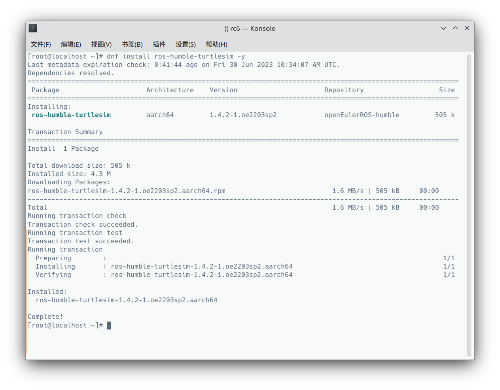
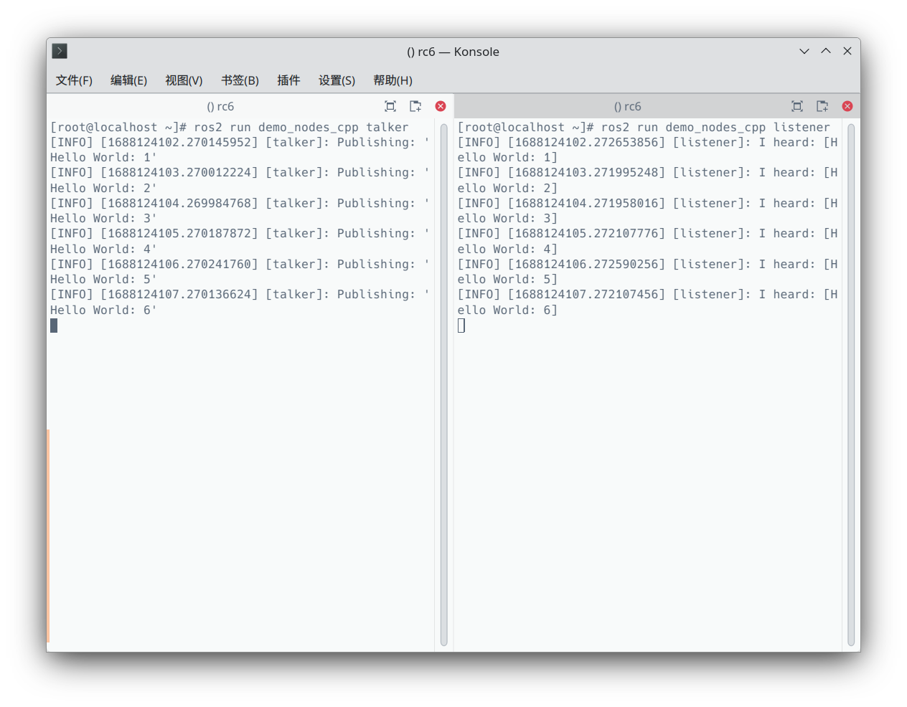

openEuler 22.03 SP2 即将发布，SP2 版本引入了 ROS humble 的支持，可以方便的使用 `dnf install ros-humble-xxx` 来安装 ros 包。下面是在 QEMU 虚拟机上进行的步骤演示~

> 以下使用 rc6 版本进行演示，正式版发布后，可省略更换软件源的步骤

1. 下载 openEuler  虚拟机镜像，可前往[此处](http://121.36.84.172/dailybuild/EBS-openEuler-22.03-LTS-SP2/)查看

   ```shell
   axel -n 64 http://121.36.84.172/dailybuild/EBS-openEuler-22.03-LTS-SP2/rc6_openeuler-2023-06-29-20-25-36/virtual_machine_img/x86_64/openEuler-22.03-LTS-SP2-x86_64.qcow2.xz
   # 解压
   unxz openEuler-22.03-LTS-SP2-x86_64.qcow2.xz
   ```

   > Tips: 使用 `axel` 等多线程下载工具可以显著提升下载速度 

2. 启动 openEuler 虚拟机

   以下脚本可以方便的使用 `qemu-system-x86` 启动虚拟机并配置好端口映射，方便 使用 ssh 连入。

   ```bash
   #!/usr/bin/env bash
   
   # The script is created for starting a riscv64 qemu virtual machine with specific parameters.
   
   RESTORE=$(echo -en '\001\033[0m\002')
   YELLOW=$(echo -en '\001\033[00;33m\002')
   
   ## Configuration
   vcpu=8
   memory=16
   memory_append=`expr $memory \* 1024`
   drive="$(ls *.qcow2)"
   ssh_port=12055
   
   cmd="qemu-system-x86_64 \
     -smp "$vcpu" -m "$memory"G \
     -drive file="$drive",format=qcow2,id=hd0 \
     -nic user,model=virtio,hostfwd=tcp::"$ssh_port"-:22"
   
   echo ${YELLOW}:: Starting VM...${RESTORE}
   echo ${YELLOW}:: Using following configuration${RESTORE}
   echo ""
   echo ${YELLOW}vCPU Cores: "$vcpu"${RESTORE}
   echo ${YELLOW}Memory: "$memory"G${RESTORE}
   echo ${YELLOW}Disk: "$drive"${RESTORE}
   echo ${YELLOW}SSH Port: "$ssh_port"${RESTORE}
   echo ""
   echo ${YELLOW}:: NOTE: Make sure ONLY ONE .qcow2 file is${RESTORE}
   echo ${YELLOW}in the current directory${RESTORE}
   echo ""
   echo ${YELLOW}:: Tip: Try setting DNS manually if QEMU user network doesn\'t work well. ${RESTORE}
   echo ${YELLOW}:: HOWTO -\> https://serverfault.com/a/810639 ${RESTORE}
   echo ""
   
   sleep 2
   
   eval $cmd
   ```

   将上诉脚本保存至镜像文件同目录，并添加可执行权限，然后执行此脚本就可以启动 openEuler 虚拟机，虚拟机的 `22` 号端口被映射到本机的 `12055`号端口。

3. 配置软件源

   使用 ssh 登入虚拟机 `root` 账户，其密码是 `openEuler12#$`

   配置软件源，编辑 `/etc/yum.repos.d/openEuler.repo` 文件，更换为以下内容：

   ```toml
   #generic-repos is licensed under the Mulan PSL v2.
   #You can use this software according to the terms and conditions of the Mulan PSL v2.
   #You may obtain a copy of Mulan PSL v2 at:
   #    http://license.coscl.org.cn/MulanPSL2
   #THIS SOFTWARE IS PROVIDED ON AN "AS IS" BASIS, WITHOUT WARRANTIES OF ANY KIND, EITHER EXPRESS OR
   #IMPLIED, INCLUDING BUT NOT LIMITED TO NON-INFRINGEMENT, MERCHANTABILITY OR FIT FOR A PARTICULAR
   #PURPOSE.
   #See the Mulan PSL v2 for more details.
   
   [OS]
   name=OS
   baseurl=http://121.36.84.172/dailybuild/EBS-openEuler-22.03-LTS-SP2/rc6_openeuler-2023-06-29-20-25-36/OS/$basearch/
   enabled=1
   gpgcheck=1
   gpgkey=http://121.36.84.172/dailybuild/EBS-openEuler-22.03-LTS-SP2/rc6_openeuler-2023-06-29-20-25-36/OS/$basearch/RPM-GPG-KEY-openEuler
   
   [everything]
   name=everything
   baseurl=http://121.36.84.172/dailybuild/EBS-openEuler-22.03-LTS-SP2/rc6_openeuler-2023-06-29-20-25-36/everything/$basearch/
   enabled=1
   gpgcheck=1
   gpgkey=http://121.36.84.172/dailybuild/EBS-openEuler-22.03-LTS-SP2/rc6_openeuler-2023-06-29-20-25-36/everything/$basearch/RPM-GPG-KEY-openEuler
   
   [EPOL]
   name=EPOL
   baseurl=http://121.36.84.172/dailybuild/EBS-openEuler-22.03-LTS-SP2/rc6_openeuler-2023-06-29-20-25-36/EPOL/main/$basearch/
   metalink=https://mirrors.openeuler.org/metalink?repo=$releasever/EPOL/main&arch=$basearch
   metadata_expire=1h
   enabled=1
   gpgcheck=1
   gpgkey=http://121.36.84.172/dailybuild/EBS-openEuler-22.03-LTS-SP2/rc6_openeuler-2023-06-29-20-25-36/OS/$basearch/RPM-GPG-KEY-openEuler
   
   [debuginfo]
   name=debuginfo
   baseurl=http://121.36.84.172/dailybuild/EBS-openEuler-22.03-LTS-SP2/rc6_openeuler-2023-06-29-20-25-36/debuginfo/$basearch/
   metalink=https://mirrors.openeuler.org/metalink?repo=$releasever/debuginfo&arch=$basearch
   metadata_expire=1h
   enabled=1
   gpgcheck=1
   gpgkey=http://121.36.84.172/dailybuild/EBS-openEuler-22.03-LTS-SP2/rc6_openeuler-2023-06-29-20-25-36/debuginfo/$basearch/RPM-GPG-KEY-openEuler
   
   [source]
   name=source
   baseurl=http://121.36.84.172/dailybuild/EBS-openEuler-22.03-LTS-SP2/rc6_openeuler-2023-06-29-20-25-36/source/
   metalink=https://mirrors.openeuler.org/metalink?repo=$releasever&arch=source
   metadata_expire=1h
   enabled=1
   gpgcheck=1
   gpgkey=http://121.36.84.172/dailybuild/EBS-openEuler-22.03-LTS-SP2/rc6_openeuler-2023-06-29-20-25-36/source/RPM-GPG-KEY-openEuler
   
   [update]
   name=update
   baseurl=http://121.36.84.172/dailybuild/EBS-openEuler-22.03-LTS-SP2/rc6_openeuler-2023-06-29-20-25-36/update/$basearch/
   metalink=https://mirrors.openeuler.org/metalink?repo=$releasever/update&arch=$basearch
   metadata_expire=1h
   enabled=1
   gpgcheck=1
   gpgkey=http://121.36.84.172/dailybuild/EBS-openEuler-22.03-LTS-SP2/rc6_openeuler-2023-06-29-20-25-36/OS/$basearch/RPM-GPG-KEY-openEuler
   
   [update-source]
   name=update-source
   baseurl=http://121.36.84.172/dailybuild/EBS-openEuler-22.03-LTS-SP2/rc6_openeuler-2023-06-29-20-25-36/update/source/
   metalink=https://mirrors.openeuler.org/metalink?repo=$releasever/update&arch=source
   metadata_expire=1h
   enabled=1
   gpgcheck=1
   gpgkey=http://121.36.84.172/dailybuild/EBS-openEuler-22.03-LTS-SP2/rc6_openeuler-2023-06-29-20-25-36/source/RPM-GPG-KEY-openEuler
   ```

   > Tips: 正式版发布后可以跳过上述修改步骤

   安装 `openeuler-ros` 包，这个包的作用是帮助配置 ROS humble 的软件源

   ```shell
   dnf install openeuler-ros
   ```

   安装完成后需要修改 `/etc/yum.repos.d/openEulerROS.repo` 文件，改为一下内容

   ```toml
   [openEulerROS-humble]
   name=openEulerROS-humble
   baseurl=http://121.36.84.172/dailybuild/EBS-openEuler-22.03-LTS-SP2/openeuler-2023-06-29-20-25-36/EPOL/multi_version/ROS/humble/$basearch/
   enabled=1
   gpgcheck=0
   
   [openEulerROS-humble-source]
   name=openEulerROS-humble-source
   baseurl=http://121.36.84.172/dailybuild/EBS-openEuler-22.03-LTS-SP2/openeuler-2023-06-29-20-25-36/EPOL/multi_version/ROS/humble/source
   enabled=1
   gpgcheck=0
   ```

   > Tips: 正式版发布后可以跳过上述修改步骤

4. 现在就可以安装需要的 ros 包啦！

   使用 `dnf install ros-humble-xxx` 就可安装指定的 ros 软件包

   ```bash
   # 以小乌龟（ros-humble-turtlesim）为例
   dnf install ros-humble-turtlesim
   ```

   

如果不介意安装全家桶的话，可以使用 `dnf install ros-humble-*` 来安装目前源里的所有 ros humble 软件包。

5. 跑个 demo 康康？

   ```shell
   #安装 `ros-humble-demo-nodes-cpp` 包
   dnf install ros-humble-demo-nodes-cpp
   # 配置环境
   source /opt/ros/humble/setup.sh
   # 分别执行以下两条命令
   ```
   
   
