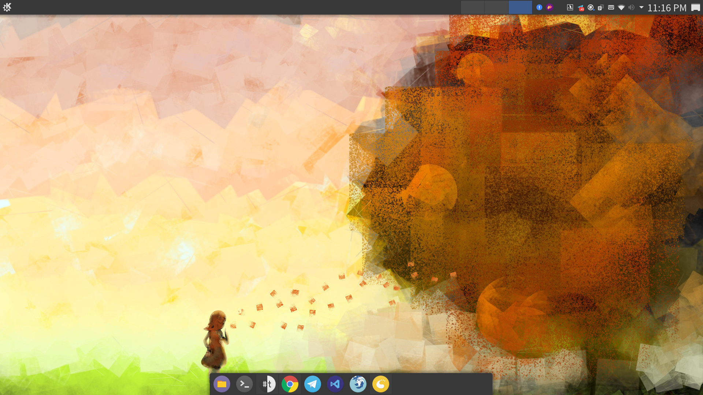
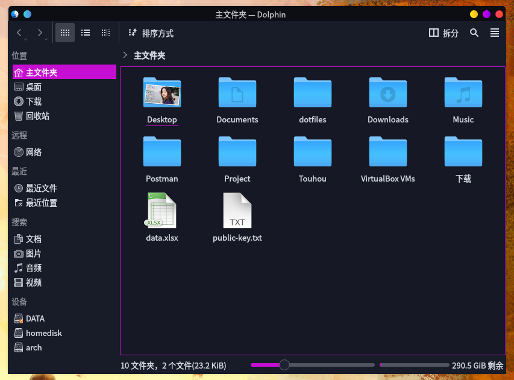
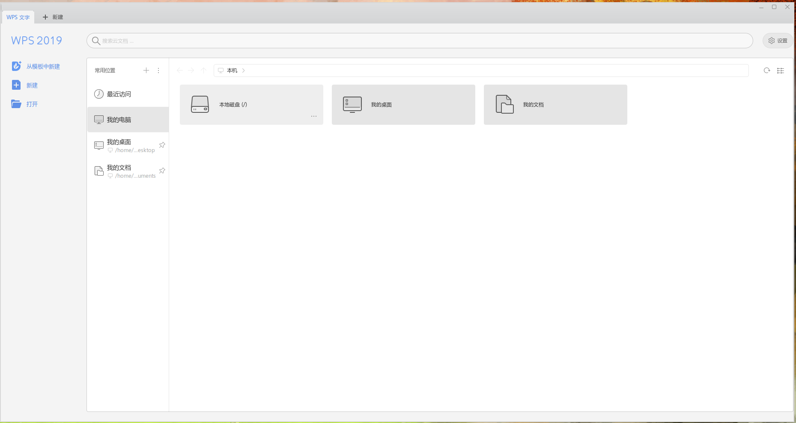
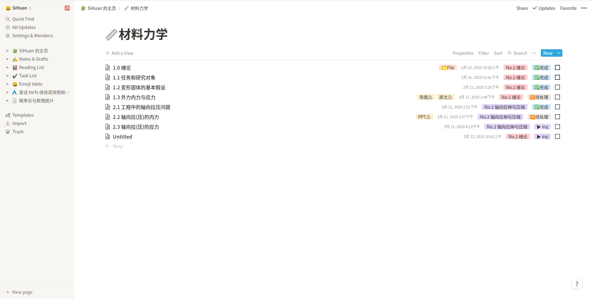
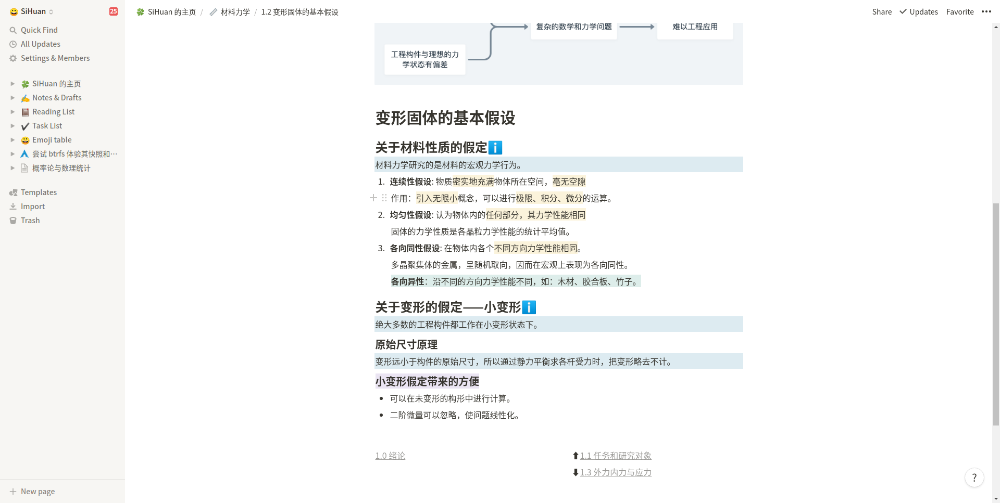
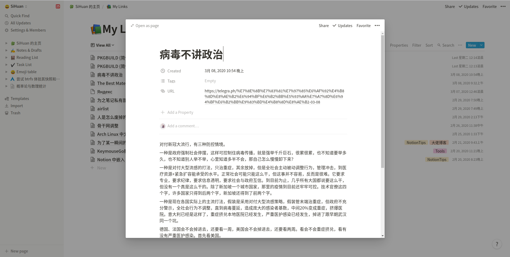
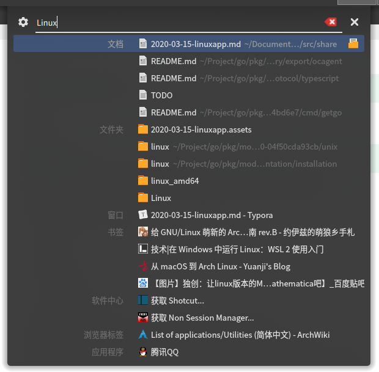
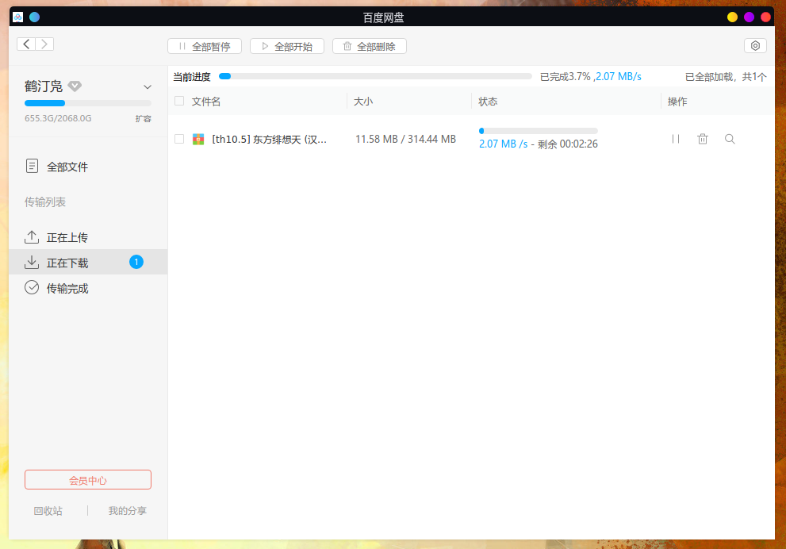
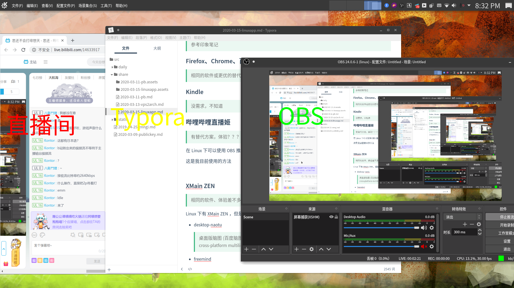
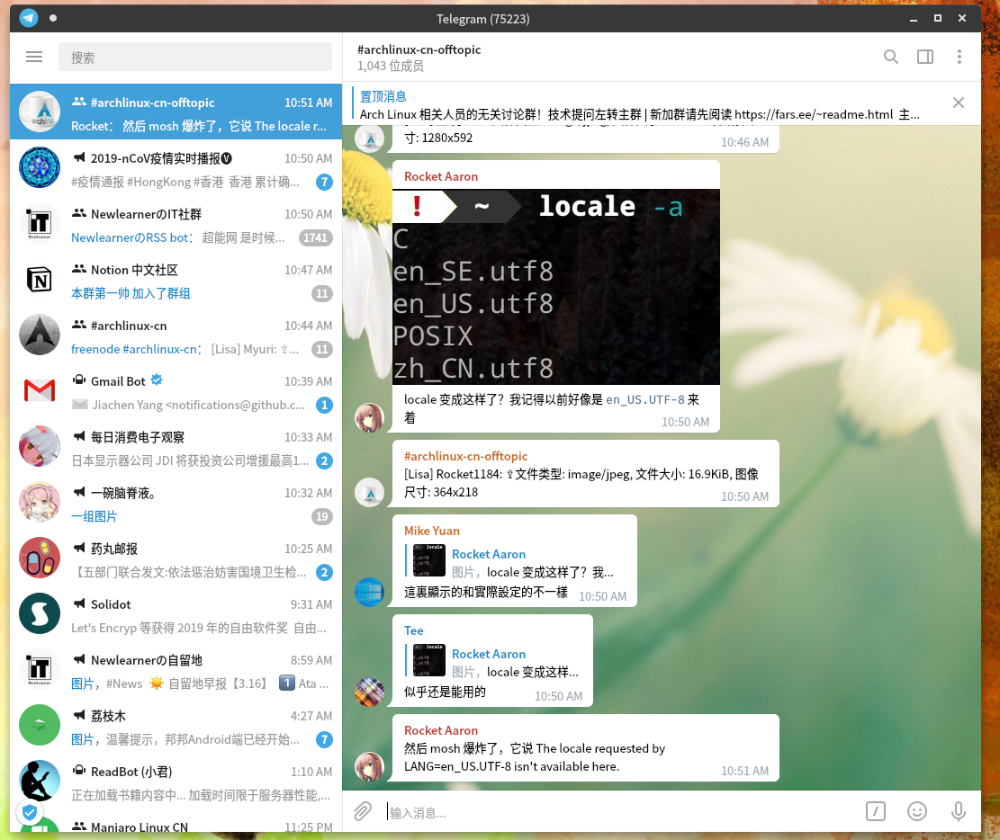

## 起因

在群聊里看到有一位同学发了一张 Windows 的桌面截图，有很多软件，大致看了一下又觉得貌似在 Linux 下也差不多都有同等或更好的替代方案，加之很多人对 Linux 的偏见认为 Linux **生态不好**，于是萌发了写这篇文章的想法。

## Windows 原图


## 逐个来看一下

> 以下完全是我自己的个人观点，我觉得好用我就说。 
>
> > **踩一捧一在任何地方都是不可取的。** --cssslayer

### 桌面

>  不置评价

首先我们接触最多的就是桌面了， Windows 自带了桌面，在 Linux 下的可选方案着实比较多，我就列几个比较常见的吧：

- KDE Plasma
- GNOME
- Xfce
- Deepin

> 一个更全的的列表见 [ArchWiki](https://wiki.archlinux.org/index.php/Desktop_environment#List_of_desktop_environments)

这个的确不大好评价，因为在 Windows 上桌面是基本没得选的，在 Linux 上选项有太多，各个之间差异比较大，而且每一个又能配出自己的花样。总的来说，Linux 上的更具有可定制性，你可以把桌面环境捏成自己想要模样。我现在使用的桌面环境是 `KDE Plasma` 。



### 文件管理器

> 不置评价

可选项也有几个，我就只说我现在正在使用的了。

我目前使用的的 `Dolphin`，不多说上图


在这儿为了让大家体验一下 Linux 桌面环境的可定制性，我决定换一套图标和窗口风格再来一张



### WPS

> 相同的软件，体验基本一致

不得不说金山还是一个很良心的企业，兼容 MS 的办公套件并且有 Linux 版本



随便打开一个表格模板


基本和 Windows 版本一致。

其他的办公套件

- LibreOffice
- OpenOffice
- FreeOffice

不得不说缺少好用、兼容微软的办公套件一直是 Linux 日常使用中的一个硬伤。好在有 `WPS`

> PDF 和 Markdown 他不香吗 ╮(￣▽￣)╭

### Typora

>相同的软件，体验基本一致

这个就不多说了，一样的软件


## Listen1

>相同的软件，体验如何俺不知道

然而我并没有尝试这个软件，这个软件倒是提供了 AppImage 安装包和 Debain 的安装包，以及我在 ArchLinux 的 `AUR` 里查到了：

```
aur/listen1-desktop 2.5.1-1 (1, 0.00)
    one for all free music in china (Build from source)    
aur/listen1-desktop-appimage 2.5.1-1 (0, 0.00)
    One for all free music in China
```

个人感觉 appimage 不大清真的样子，从源代码构建的话还好些，不过听音乐我网易云就够啦


### Wise Folder Hider Pro

> 不知道是啥

### 互传

> 不知道是啥

虽然我没有用过这个软件，但是大概从软件名字可以推断出来是一个收发文件的软件，在 Linux 下有很多优秀的解决方案，足以写一片完整的文章，这个算是平手吧。

### 2345 看图王

> 体验更优的同类应用

查看图片我现在使用的是  `Gwenview` ，这是 KDE 应用的一员，体验良好，对于简单的图片查看，放缩旋转等操作足以胜任。我认为优于 `2345 看图王` 。

### 小药丸工具箱

> 不知道是啥

### 网易云音乐

> 相同的软件，体验略差一丢丢


说体验差一点的原因是，在 KDE 下刚装好的网易云音乐会有不能输入中文的情况，需要改动一个文件，不过这个问题在 ArchLinux 上也许就要被修复了。

### 有道词典

> 不置评价

因为我没有使用词典软件的习惯，所以就不好评价了，但是 ArchLinux 上有有道词典的软件包，具体体验如何，我就不得而知了。

### 微信

> 有替代方案，但体验不佳

- electronic-wechat
- wine-wechat

一个是网页微信的方案，一个是基于 Wine 的方案，但是总体来说不如 Windows 下用的舒服。这个 Windows 完胜。

好在我不是一个重度微信用户，手机微信也没大打开过。

### 印象笔记

> 实力相当的替代方案

ArchLinux 上有 Evernote 的客户端，但是我也不用 ´_>`

当时 Evernote 有网页版吧，体验貌似也许不如客户端

另外一个替代产品 `notion` ， 网页版体验不错，不过这种笔记软件大概迁移的时候会很麻烦，好在 `notion` 支持从 `Evernote` 导入。





类似于 Evernote 的剪藏功能



### 福欣 pdf 阅读器

> 相同的软件

福欣 pdf 阅读器有 Linux 版本。我曾使用过，但是我没使用过 Windows 版本，所以就不置评价了

另外，我现在阅读 pdf 的方案

- Chrome  直接用浏览器查看 pdf
- WPS         WPS 也能看 pdf 呢
- Okular    KDE 应用里的 PDF 阅读器 （值得一试

### PS

> 有替代方案，但体验不佳

替代方案

- GIMP
- inkscape
- wine ps

我不懂 PS ，但是我知道 Linux 上的确不好使

GIMP 倒是也不是不能用的，这个软件同时也有 Windows 版本，可以去试一下。

### Pr ?

> 同 PS 吧，我不懂

### LOL

> 基本无解

国服 LOL 在 Linux 下是无解的，这得益于腾讯的防作弊检测系统 (╥_╥)。

在 Linux 下我玩过的游戏：

- Dota2
- CSGO
- 300 英雄
- 东方Project一众

Dota2 和 CSGO 在 Linux 上是原生运行的，基本没啥差别。

300 英雄是我借助  wine 运行的，性能有点问题，风扇转的比 Windows 下猛

东方的话 wine 完全没有问题，稳定 60 帧， 有没有兴趣联机绯想天呀 2333


### Everything

> 有同类型软件，体验甚至更优

不得不说 Everything 是 Windows  平台上一款比较优秀的软件，搜索非常迅速，不过在 Linux 系统下，替代的工具有很多，比如我现在正在使用的 KDE Plasma 自带的 `KRunner`。



支持的范围非常广，大概关掉一些功能就可以和 Everything 得到一样的体验了，哈哈

### PotPlayer

> 有同类产品，体验较好

跳过了两个不认识的软件，以后不认识的我就跳过了(╥_╥)

PotPlayer 是 Win 下很 nice 的视频播放器，本地视频和网络流都有支持，不过 Linux 下的也不差呀

- MPV
- VLC

### IDM

> 有同类产品，体验参差不一

下载工具

- kget
- uget
- matrix
- aria2

我对下载文件这方面的需求不大，一般浏览器就可以满足我的要求，关于 **百度网盘** 的下载问题，我们到后边详细解释

### CodeBlocks

> 相同的软件，体验一致

CodeBlocks 有 Linux 版本啦

不过为什么不用 `VS Code` 呢。

> 严格来说还要配合 gcc 的，毕竟 VSC 只是一个**编辑器**呢

### 百度网盘

> 不置评价

因为百度网盘在 Windows 下的体验也极其让人恶心，我就不做比较了，在 Linux 下你可以用

- 百度网盘官方 Linux 客户端  而且**不限速**
- BaiduPCS-go   之前的一个神器，命令行版本，**不限速** ，已凉



### 有道云笔记

> 参考印象笔记

### Firefox、Chrome、百分浏览器、QQ 浏览器

> 相同的软件或更优的替代软件

真的搞不懂为什么 win 平台上会有这么多浏览器

### Kindle

> 没需求，不知道

### 哔哩哔哩直播姬

> 有替代方案，体验还可以吧

在 Linux 下可以使用 OBS 推流，不过就看不到观众的弹幕了。只好再打开一个网页看自己直播 (

这是我目前使用的方法



### XMain ZEN

> 相同的软件、体验差不多的同类软件

Linux 下有 XMain ZEN ，但是这是一个收费软件，现有以下免费的方案

- desktop-naotu

  > 桌面版脑图 (百度脑图离线版，思维导图) 跨平台支持 Windows/Linux/Mac OS. (A 
  >    cross-platform multilingual Mind Map Tool)

- freemind

### QQ

> 基本同微信，Windows 完胜

Linux 下的替代方案：

- QQ for Linux

  > 腾讯的官方产品，能用的程度

- Deepin Wine QQ

- Deepin Wine Tim

  > Deepin 团队制作的 Wine 版本，体验还是比较好的，但是有一些小 Bug，这是我之前使用的方案

因为在 Linux 下使用 QQ 的需求也不是特别大，目前使用 `QQ for Linux`


> Telegram 他不香嘛？




### 钉钉、腾讯课堂

> Windows 完胜

Wine 钉钉方案，能用的程度

这些国产软件太草了哦，没的办法，这种也没办法找替代品呀， wine 方案其实也还好，但是它没有原生清真啊

### 电脑管家

> 无论 Linux 还是我都不再需要一个**电脑管家**来管理系统

### 腾讯网游加速器

> 此处仅有一个滑稽

### Sublime

> 同样的软件，一致的体验

这个就没有啥好说的了哎

Sublime 有 Linux 版本，而且 Linux 下也有一众很优秀的编辑器

- 圣战双方 vim & emacs
- VS Code
- Kate

我现在使用的是 `VS Code` 和 `vim`

## 等等，我是不是落下了什么东西？


没错我是故意把它拉出来的，我就是要羞辱它

我 `pacman` 把它按地上锤

```
sihuan ~ $ pacman -help     
用法:  pacman <操作> [...]
操作:
    pacman {-h --help}
    pacman {-V --version}
    pacman {-D --database} <选项> <软件包>
    pacman {-F --files}    [选项] [软件包]
    pacman {-Q --query}    [选项] [软件包]
    pacman {-R --remove}   [选项] <软件包>
    pacman {-S --sync}     [选项] [软件包]
    pacman {-T --deptest}  [选项] [软件包]
    pacman {-U --upgrade}  [选项] <文件>

使用 'pacman {-h --help}' 及某个操作以查看可用选项

```

这个优点是值得长篇大论的，***这儿写不下*** ლ(╹◡╹ლ)